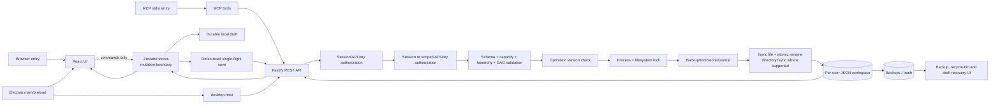

# TodoGraph Architecture

TodoGraph is a TypeScript/pnpm monorepo delivered as a browser application, a portable Electron application, an HTTP server, and an MCP server. The canonical domain schemas live in `@todograph/shared`; DAG algorithms remain transport- and storage-independent in `@todograph/core`.

## Whole-system flow



## Persistence pipeline

```text
UI command
  -> immutable Zustand mutation
  -> user-scoped local draft
  -> queued save
  -> authenticated request
  -> schema/domain/capacity validation
  -> page/meta optimistic lock
  -> cross-process workspace lock
  -> recovery point or journal
  -> fsync temporary/recovery file
  -> atomic rename
  -> fsync parent directory where supported
  -> acknowledge version
  -> clear only the matching local draft
```

Destructive operations must create a flushed recovery point before their commit point. Import aborts if the current workspace cannot be exported. Restore snapshots the live page first and checks the caller's expected page version. Delete writes a tombstone before removing page metadata. Multi-page writes use a recovery journal. Page backups, import snapshots, and deleted-page tombstones are bounded by both count and bytes while always retaining the newest recovery point.

When a page version conflicts, the server version remains authoritative for the original page, while the client preserves local edits in a recovery page or, if that fails, a user-scoped device draft. The account/data panel can restore hidden conflict drafts as new pages and restore deleted pages from the recycle bin.

## Package ownership

| Package | Ownership |
|---|---|
| `@todograph/shared` | Canonical schemas, hierarchy validation, geometry and limits |
| `@todograph/core` | Pure DAG and recommendation algorithms |
| `@todograph/server` | Authentication, HTTP validation/orchestration, repositories |
| `@todograph/app` | React UI, Electron shell, Zustand mutation and draft lifecycle |
| `@todograph/desktop-host` | Loopback Fastify lifecycle and Electron session-secret ownership |
| `@todograph/mcp` | MCP transport and TodoGraph tool orchestration |

## Storage layout and invariants

```text
data/users/{userId}/
  meta.json
  pages/{pageId}.json
  backups/{pageId}/{timestamp}.json
  backups/_workspace-imports/{timestamp}.json
  trash/pages/{timestamp}-{pageId}.json
  .save-pages-journal.json
  .workspace-import-journal.json
  .workspace.lock
```

- `meta.json` must never reference a missing or invalid page file.
- External page operations must reference a page present in `meta.pages`.
- Only one local-filesystem writer may hold `.workspace.lock`; the atomic directory lock is refreshed while held. Network filesystems are outside this repository's supported consistency model.
- Shared v2 migration data is claimed under a root-scoped lock so only one user can receive it.
- UI-generated API keys default to read/write scope; delete, restore, cross-page move, and destructive commands sent through a generic write endpoint require explicit destructive scope. Legacy environment keys remain full-access for compatibility.
- New pages are limited by serialized bytes as well as node, edge, metadata, and depth counts. The workspace byte quota is growth-aware so an oversized legacy workspace can still be reduced without first becoming unreadable.
- Legacy migration sources remain available until the new metadata commit succeeds.
- A successful save may clear only the exact draft it persisted; newer drafts remain recoverable.
- Generated output (`dist/`, `Build/`, dependencies and runtime `data/`) is not authored source.
