# TodoGraph Architecture

TodoGraph is a TypeScript/pnpm monorepo delivered as a browser application, portable Electron application, Capacitor mobile application, HTTP server, and MCP server. The canonical domain schemas live in `@todograph/shared`; DAG algorithms remain transport- and storage-independent in `@todograph/core`.

Product behavior is specified in [`docs/behavior/`](./docs/behavior/). Architecture describes ownership and boundaries; behavior documents define user-visible transitions and gesture priority.

## Workspace navigation state

Mode and view are independent concepts. Checklist mode can only render the list view. Page mode can render list or dependency-graph view and retains a session-scoped `{ pageId, view }` return context. The system hierarchy page is the checklist data source, not the storage location for page-mode navigation history.

## Whole-system flow

```mermaid
flowchart LR
  Browser[Browser entry] --> React[React UI]
  Electron[Electron main/preload] --> React
  Mobile[Capacitor iOS / Android] --> React
  Mobile --> Native[Keyboard, system bars,<br/>haptics and secure session]
  Electron --> Host[desktop-host]
  MCP[MCP stdio entry] --> MCPDispatch[Registered-tool lookup<br/>and input validation]
  MCPDispatch --> McpTools[MCP tools]
  MCPDispatch -->|tool absent| MCPError[MCP tool-not-found result]

  React -->|commands only| Zustand[Zustand stores\nmutation boundary]
  React -->|HTTPS + native bearer| HTTP
  Zustand --> PageCache[Session page-data LRU\nread-through switch cache]
  PageCache --> Zustand
  Zustand --> Draft[Durable local draft]
  Zustand --> Queue[Debounced single-flight save]
  Queue --> HTTP[Fastify REST API]
  McpTools --> HTTP
  Host --> HTTP

  HTTP --> Auth[Session/API-key authentication]
  Auth --> MCPVersion[MCP version-header validation]
  MCPVersion -->|missing or malformed| MCPUpgrade[426 MCP_UPDATE_REQUIRED]
  MCPVersion -->|valid; older gets advisory header| Scope[Session or scoped API-key authorization]
  Scope --> Validate[Schema + capacity + hierarchy + DAG validation]
  Validate --> Version[Optimistic version check]
  Version --> Lock[Process + filesystem lock]
  Lock --> Recovery[Backup/tombstone/journal]
  Recovery --> Atomic[fsync file + atomic rename<br/>directory fsync where supported]
  Atomic --> Data[(Per-user JSON workspace)]

  Data --> HTTP
  HTTP --> Zustand
  Zustand --> React
  Data --> Backup[(Backups / trash)]
  Backup --> RecoveryUI[Backup, recycle-bin and draft recovery UI]
```



## MCP compatibility pipeline

```text
tools/call
  -> registered-tool lookup (missing tools stop here; no HTTP request is made)
  -> MCP input validation
  -> authenticated TodoGraph HTTP request
  -> validate MCP version header
     -> missing or malformed: stop with MCP_UPDATE_REQUIRED
     -> valid and older: execute compatible route and append the advisory header to its result
     -> current or newer: execute compatible route normally
```

If an MCP-backed HTTP route is absent, version direction determines the recovery message: an older or unidentified MCP must update MCP, while a current or newer MCP must update TodoGraph. Publishing builds shared before MCP, then compares the packed artifact with the exact npm version and npm `latest` before publishing or skipping. npm, Docker, and desktop release workflows share this serialized guard; a manual desktop release explicitly dispatches the version-tagged Docker build after creating its release tag because `GITHUB_TOKEN` tag creation does not trigger another workflow.

## Persistence pipeline

```text
UI command
  -> immutable Zustand mutation
  -> user-scoped local draft
  -> queued save
  -> authenticated request
  -> schema/domain/capacity validation
  -> page/meta optimistic lock
  -> cross-process workspace lock
  -> recovery point or journal
  -> fsync temporary/recovery file
  -> atomic rename
  -> fsync parent directory where supported
  -> acknowledge version
  -> clear only the matching local draft
```

## List drag pipeline

```text
mouse movement or touch long-press arbitration
  -> one gesture state (scroll / swipe / drag / edit)
  -> drag activation and page-scroll lock
  -> pure drop-intent classification (reorder / nest / unparent / none)
  -> insertion or nesting feedback + edge auto-scroll
  -> one Zustand command on release
  -> terminal-state cleanup on release / cancel / lost input / unmount
  -> one undo snapshot + scheduled persistence
```

Ready and Blocked roots are displayed in reverse storage order, while Done roots and child rows use forward storage order. The drag intent carries that direction explicitly so the store never infers presentation order from hierarchy alone.

Destructive operations must create a flushed recovery point before their commit point. Import aborts if the current workspace cannot be exported. Restore snapshots the live page first and checks the caller's expected page version. Delete writes a tombstone before removing page metadata. Multi-page writes use a recovery journal. Page merge is owned by the repository: it backs up both pages, writes the source tombstone and journal, writes the target, then commits by replacing metadata; startup either finalizes that exact pair or restores both pages and metadata. Page backups, import snapshots, and deleted-page tombstones are bounded by both count and bytes while always retaining the newest recovery point.

When a page version conflicts, the server version remains authoritative for the original page, while the client preserves local edits in a recovery page or, if that fails, a user-scoped device draft. The account/data panel can restore hidden conflict drafts as new pages and restore deleted pages from the recycle bin.

Page switching follows `flush current page -> remember bounded session snapshot -> paint cached target when present -> refresh target from server -> poll active version`. The cache is cleared on session reset and never replaces server version checks; it only removes the blank/network wait when revisiting a page.

The `/api/all-tasks` cache is user-scoped, byte-bounded and LRU-bounded. Repository mutations invalidate only the authenticated user's entry. Aggregation attaches the shared default recommendation score, so the UI-facing data and MCP apply the same ready/doing/downstream ordering.

## Mobile runtime boundary

The Capacitor bundle contains the same Vite application but must be built with one explicit public HTTPS server origin. Browser and Electron authentication continue to use encrypted, `SameSite=Strict` cookies. Native login/register endpoints issue a separate opaque bearer token whose hash and purpose are stored server-side. A native token is never accepted as an MCP key or browser remember token.

Persistent native tokens live only in the platform secure-session plugin: Android encrypts the value with an Android Keystore AES-GCM key and disables application backup; iOS stores it in Keychain with `AfterFirstUnlockThisDeviceOnly`. Non-persistent native sessions remain in JavaScript memory. Logout and password changes revoke server-side tokens; password change returns one replacement token for the current native session.

Native interaction calls are owned by `src/platform/`, not task components. They are optional enhancements: failure of haptics, keyboard, system-bar, or secure-storage bridges must not corrupt task state. The behavior contract is [`docs/behavior/native-platform.md`](./docs/behavior/native-platform.md).

## Package ownership

| Package | Ownership |
|---|---|
| `@todograph/shared` | Canonical schemas, hierarchy validation, geometry and limits |
| `@todograph/core` | Pure DAG and recommendation algorithms |
| `@todograph/server` | Authentication, HTTP validation/orchestration, repositories |
| `@todograph/app` | React UI, Electron/Capacitor shells, Zustand mutation and draft lifecycle |
| `@todograph/desktop-host` | Loopback Fastify lifecycle and Electron session-secret ownership |
| `@todograph/mcp` | MCP transport and TodoGraph tool orchestration |

## Storage layout and invariants

```text
data/users/{userId}/
  meta.json
  pages/{pageId}.json
  backups/{pageId}/{timestamp}.json
  backups/_workspace-imports/{timestamp}.json
  trash/pages/{timestamp}-{pageId}.json
  .save-pages-journal.json
  .workspace-import-journal.json
  .workspace.lock
```

- `meta.json` must never reference a missing or invalid page file.
- External page operations must reference a page present in `meta.pages`.
- Only one local-filesystem writer may hold `.workspace.lock`; the atomic directory lock is refreshed while held. Network filesystems are outside this repository's supported consistency model.
- Shared v2 migration data is claimed under a root-scoped lock so only one user can receive it.
- UI-generated API keys default to read/write scope; delete, restore, cross-page move, and destructive commands sent through a generic write endpoint require explicit destructive scope. Legacy environment keys remain full-access for compatibility.
- New pages are limited by serialized bytes as well as node, edge, metadata, and depth counts. The workspace byte quota is growth-aware so an oversized legacy workspace can still be reduced without first becoming unreadable.
- Legacy migration sources remain available until the new metadata commit succeeds.
- A successful save may clear only the exact draft it persisted; newer drafts remain recoverable.
- Generated output (`dist/`, `Build/`, dependencies and runtime `data/`) is not authored source.
