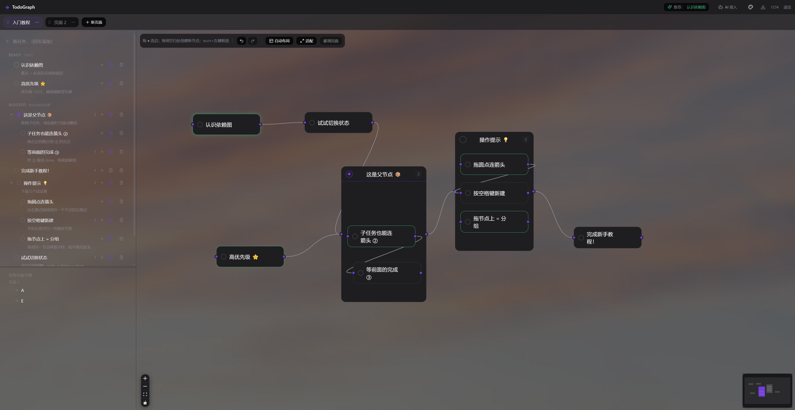
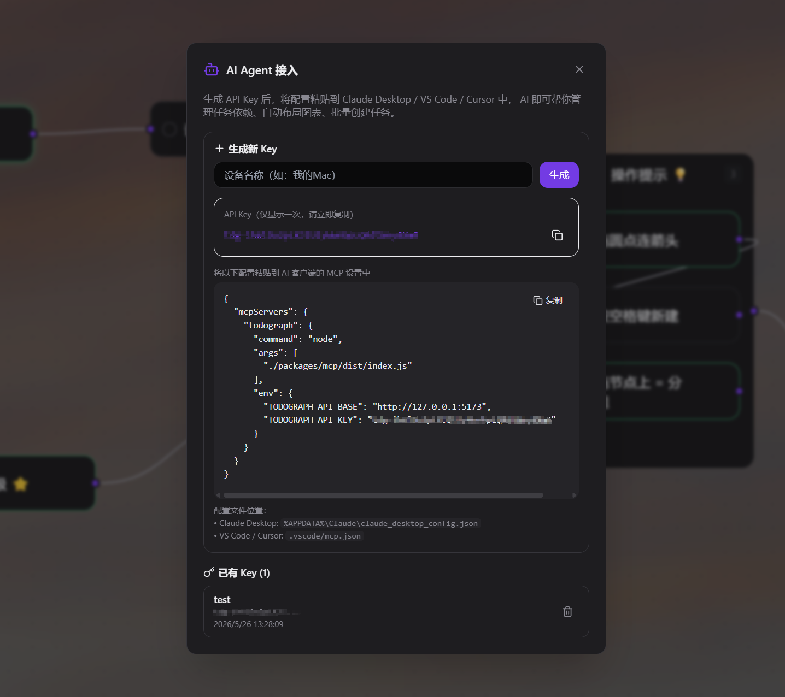
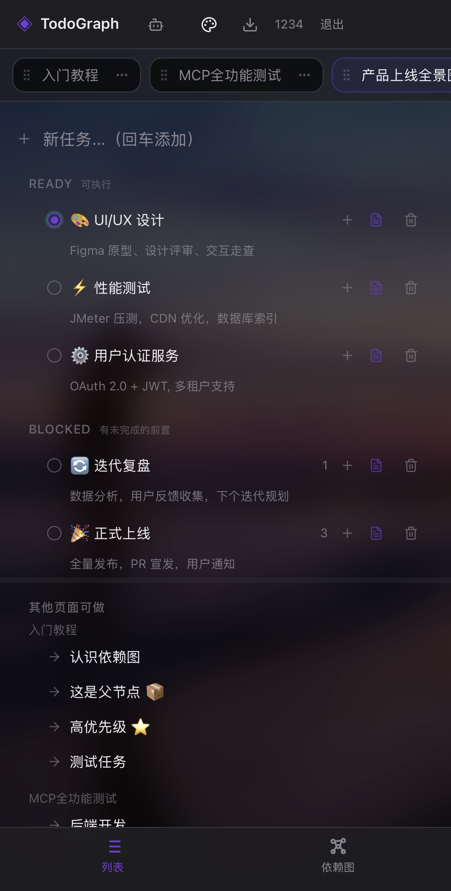
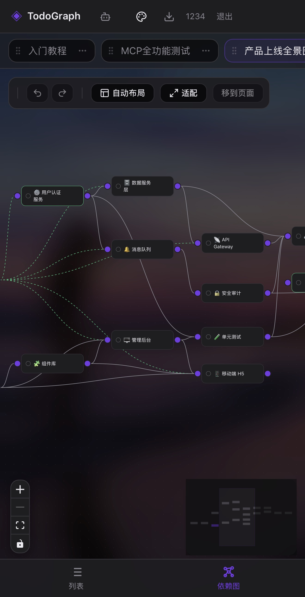

# TodoGraph

> 把 Todo 建成一张依赖图——任务不再是平铺列表，而是一个可计算的 DAG，系统告诉你"此刻最该做什么"。

<p align="center">
  <a href="./LICENSE"></a>
  <a href="https://github.com/UriPomer/TodoGraph/stargazers"></a>
  <a href="https://github.com/UriPomer/TodoGraph/issues"></a>
  <a href="https://github.com/UriPomer/TodoGraph/commits/main"></a>
  <a href="https://github.com/UriPomer/TodoGraph/releases"></a>
</p>

<p align="center">
  
  
  
  
  
  
  
  
</p>

---

## 截图

### PC 端



### AI 接入



### 移动端

| 列表视图 | 依赖图视图 |
|---|---|
|  |  |

---

## 为什么做这个

经典 Todo app 的问题：任务之间的顺序关系没法表达。TodoGraph 把任务当成 DAG 节点，有向边表示依赖——系统自动算出哪些能做、哪些被阻塞、以及当前最该做哪件。建边时实时检测环，不会让你给自己挖坑。

---

## 快速开始

需要 Node.js ≥ 22 和 pnpm。

```bash
git clone https://github.com/UriPomer/TodoGraph.git
cd TodoGraph
pnpm install
pnpm dev              # 同时起 Fastify(5173) + Vite(5174)
# 浏览器打开 http://127.0.0.1:5174/
```

Docker 部署：

```bash
cp .env.example .env
# 把 .env 中的 SESSION_SECRET 换成你自己的 32 字节随机值
docker compose up -d  # 监听 127.0.0.1:3000，数据持久化在 ./data
```

PowerShell 可用 `Copy-Item .env.example .env`。默认回环地址使用 HTTP，因此 `COOKIE_SECURE=false`；放到 HTTPS 反向代理后应改为 `true`。

文件存储模式会用跨进程锁串行化同一台机器上对 `DATA_DIR` 的写入；不要把数据目录放在网络文件系统上。需要跨主机多实例部署时应先切换到支持事务的数据库存储。

打包 Windows 便携版 EXE：双击 `build.bat`，产物在 `Build/`，拷到任何 Win10/11 机器双击即用。

Electron 开发模式：`pnpm dev:electron`

原生移动壳使用 Capacitor，并连接已部署的 HTTPS 服务：

```bash
# PowerShell 示例；构建会拒绝 HTTP、路径或缺失的 origin
$env:VITE_API_BASE='https://todo.example.com'
pnpm --filter @todograph/app build:mobile
pnpm --filter @todograph/app mobile:android
```

Android 工程可在 Windows/Android Studio 构建，Capacitor 8 的原生编译需要 JDK 21；iOS 工程需在 macOS/Xcode 中编译和签名。浏览器 cookie 与原生安全 token 相互隔离，持久原生会话分别保存在 Android Keystore 和 iOS Keychain。

---

## AI 接入 (MCP)

支持 [Model Context Protocol](https://modelcontextprotocol.io/)，让 Claude Desktop / VS Code / Cursor 直接管理任务。顶部栏点「AI 接入」生成配置，12 个 MCP 工具覆盖创建、更新、删除、推荐、自动布局、备份恢复。新 Key 默认只有读取与安全写入权限；删除、恢复和跨页面移动需要生成时显式启用破坏性权限。

---

## 核心概念

```ts
interface Task {
  id: string;
  title: string;
  status: 'todo' | 'doing' | 'done';
  description?: string;
  parentId?: string;           // 父任务，层级分组（最大深度 3 层）
  x?: number; y?: number;      // 图中位置，有 parentId 时相对父节点
}

interface Edge {
  from: string;  // 前置任务
  to: string;    // 后继任务，"to 必须在 from 之后"
}
```

- **Ready**: 所有前置都已完成，立刻能开干
- **Blocked**: 还有未完成的前置
- **Recommendation**: 默认按 doing 优先 + 下游影响大排序，实现 `RecommendationStrategy` 接口即可替换策略
- **多页面**: 每个页面是独立的图，跨页移动任务自动带整棵子树
- **认证**: session-based (加密 httpOnly cookie)，注册需 `REGISTRATION_KEY`，多用户数据隔离

---

## 架构

```
packages/
├─ core/        DAG 引擎（纯函数，类型复用 shared）
├─ shared/      Zod schema（前后端共享，单一真源）
├─ server/      Fastify 5 后端 + 可替换的 Repository
├─ app/         React 18 前端 + Electron 壳
├─ desktop-host/ Electron 本地服务生命周期与会话密钥
└─ mcp/          独立发布的 MCP 服务与工具
```

前端只和 Zustand store 交互，修改先写本地恢复草稿，再由 store 250ms 防抖写后端；后端校验容量、依赖 DAG 与父子层级，并在恢复点之后原子写 JSON。完整数据流与安全不变量见 [ARCHITECTURE.md](./ARCHITECTURE.md)。退出或切换账号时统一清理 store、历史记录和轮询。换存储只需实现 `WorkspaceRepository` 接口。所有颜色走 `hsl(var(--xxx))` CSS 变量，加主题等于加一段 CSS。

技术栈：TypeScript 5 · React 18 · Vite 6 · React Flow · Zustand · Fastify 5 · Tailwind CSS 3 · Electron 39 · pnpm workspace · Vitest 3

---

## 开发

| 命令 | 作用 |
|---|---|
| `pnpm dev` | Fastify(5173) + Vite(5174) |
| `pnpm dev:electron` | Electron + HMR |
| `pnpm -r build` | 编译所有包 |
| `pnpm test` | 构建依赖并运行所有包测试 |
| `pnpm typecheck` | 运行所有包 TypeScript 检查 |
| `pnpm package` | 打 Windows portable exe |
| `pnpm --filter @todograph/app build:mobile` | 用 `VITE_API_BASE` 构建并同步 iOS/Android |

改 `packages/shared/src/schema.ts` 后先 `pnpm --filter @todograph/shared build`，前端/后端才能拿到新类型。

---

## Roadmap

- [x] 多页面工作区、层级分组、撤销/重做
- [x] 移动端适配（手势交互、底部导航）
- [x] 用户认证、Markdown 导出
- [x] Docker 部署 + CI/CD
- [x] AI Agent (MCP)
- [ ] 时间约束（deadline 推荐）
- [ ] SQLite 存储、远程协作
- [ ] macOS / Linux 打包
- [ ] OPML / JSON 导入导出

---

## 贡献

欢迎 PR 和 issue。TS 严格模式，所有写入走 Zustand → 防抖 → Repository，组件颜色只用主题变量。

---

## License

[MIT](./LICENSE) © TodoGraph contributors

---

## 致谢

- [@xyflow/react](https://reactflow.dev/) — React Flow 图编辑器
- [shadcn/ui](https://ui.shadcn.com/) — 设计系统
- [Fastify](https://fastify.dev/) — 后端框架
- [Zustand](https://zustand.docs.pmnd.rs/) — 状态管理
- [dagre](https://github.com/dagrejs/dagre) — 自动布局
