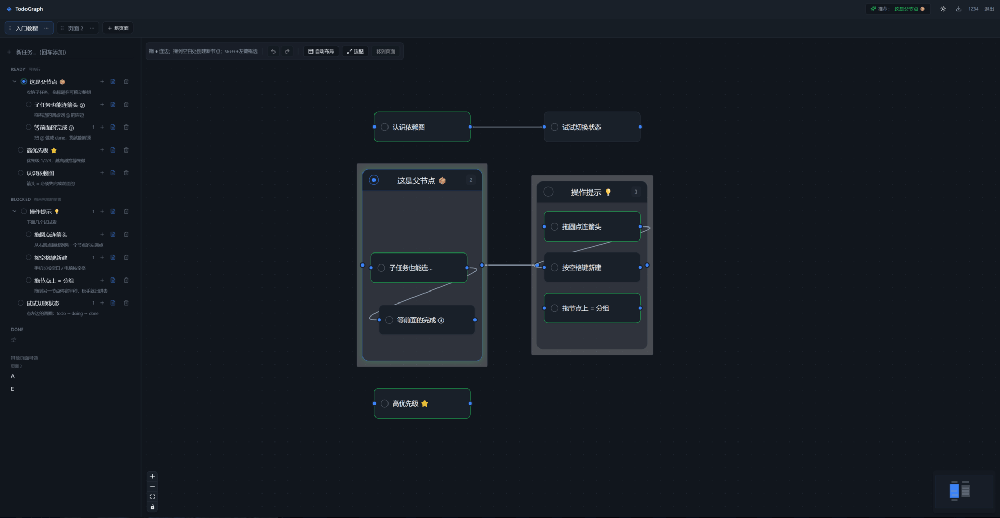
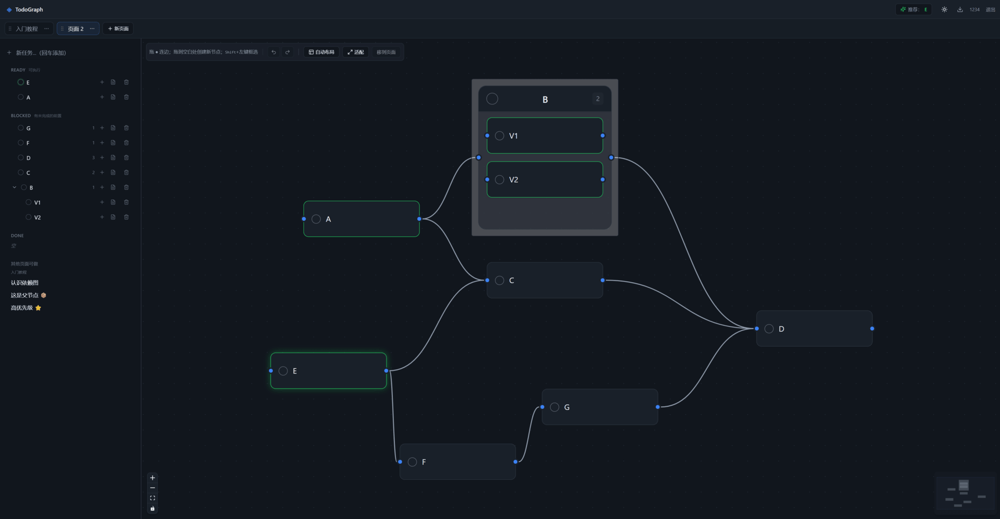
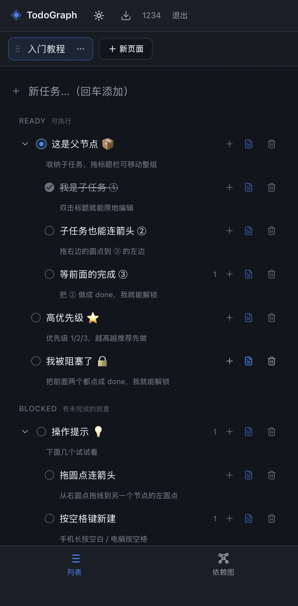
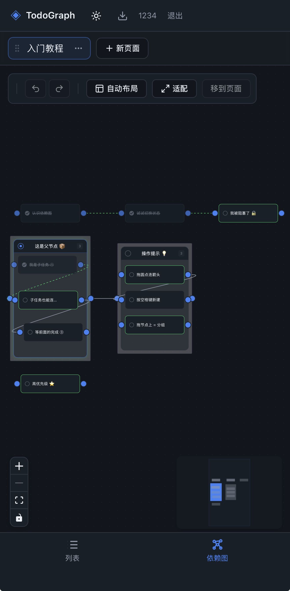

# TodoGraph

> **把 Todo 建成一张依赖图**。任务不再是一条列表，而是一个可计算的 DAG — 系统自动告诉你"此刻最该做什么"。

<p align="center">
  <a href="./LICENSE"></a>
  <a href="https://github.com/UriPomer/TodoGraph/stargazers"></a>
  <a href="https://github.com/UriPomer/TodoGraph/issues"></a>
  <a href="https://github.com/UriPomer/TodoGraph/commits/main"></a>
  <a href="https://github.com/UriPomer/TodoGraph/releases"></a>
</p>

<p align="center">
  
  
  
  
  
  
  
  
</p>

<p align="center">
  <a href="#-快速开始">快速开始</a> ·
  <a href="#-ai-agent-mcp">AI 接入</a> ·
  <a href="#-截图">截图</a> ·
  <a href="#-核心概念">核心概念</a> ·
  <a href="#-架构">架构</a> ·
  <a href="#-开发">开发</a> ·
  <a href="#-贡献">贡献</a>
</p>

---

## 为什么要做这个

经典 Todo app 的问题是：**任务之间的顺序关系无法表达**。"先做 A，B 要在 A 之后，C 要等 A 和 D 都做完" —— 这种依赖在平铺列表里只能靠脑子记。

TodoGraph 把每个任务视为图里的一个节点，节点之间的有向边表示"必须在…之后"。基于这个结构：

- **Ready 列表**：依赖都已完成、立刻就能开干的任务
- **Blocked 列表**：等前置任务的
- **推荐**：综合 `doing > 下游影响大` 自动选出当前最应该做的一件事
- **防止死循环**：建边时实时检测环，不允许你给自己挖坑

---

## ✨ 特性

- 🕸️ **DAG 驱动**：任务以图形式组织，系统算出"解锁"与"阻塞"状态
- 🎯 **智能推荐**：策略可替换（`RecommendationStrategy` 接口），默认按 doing / 下游影响排序
- 🧱 **三种视图**：列表（Ready/Blocked/Done 分组）、依赖图（React Flow，可拖拽、自动布局）、跨页全局就绪（所有页面的 ready 任务聚合）
- 📄 **多页面工作区**：页面标签、拖拽排序、跨页任务移动（自动带子树、防碰撞放置）
- 🏗️ **层级分组**：3 级嵌套，父子任务容器（compound node），建边时防 parent 环
- 📝 **任务描述**：长文本描述字段，hover 出 tooltip
- 📱 **移动端适配**：底部导航栏、滑动手势（左滑完成/右滑删除/下拉新建）、触控优化、纯 DOM 动画 60fps
- ↩️ **撤销/重做**：Cmd-Z / Cmd-Y + 工具栏按钮，全量快照
- 🔄 **乐观锁**：版本号冲突检测，防止多端覆盖
- 🔐 **用户认证**：注册/登录，session 管理，多用户数据隔离
- 📋 **Markdown 导出**：一键导出当前页为 Markdown
- 🎨 **深色 / 浅色一键切换**：所有颜色走 HSL CSS 变量，新增主题 = 新增一段 CSS
- 💾 **自动备份**：每 60 秒脏页自动保存
- 🖥️ **双形态**：浏览器 Web 版 & Electron 桌面版（同一套前端代码）
- 📦 **Portable EXE**：打包后就一个 `.exe`，拷到别的电脑双击即可运行，数据跟着走
- 🐳 **Docker 部署**：多阶段构建 + docker-compose，GitHub Actions CI/CD 自动推 ghcr.io
- 🤖 **AI 接入 (MCP)**：12 个 MCP 工具，AI 助手直接管理任务 — 创建、更新、删除、推荐、自动布局、备份恢复，支持 Claude Desktop / VS Code / Cursor
- 🔒 **类型安全**：TypeScript 严格模式 + Zod schema 单一真源，前后端类型自动一致
- 🧪 **核心有测试**：`@todograph/core` 纯函数 DAG 引擎全部 Vitest 覆盖

---

## 🤖 AI Agent (MCP)

TodoGraph 支持 [Model Context Protocol](https://modelcontextprotocol.io/)，让 AI 助手（Claude Desktop / VS Code / Cursor）直接管理你的任务。

### 快速接入

1. 打开 TodoGraph → 顶部栏点击 **「AI 接入」**（🤖 图标）
2. 输入设备名 → 点击 **生成**
3. 复制配置 → 粘贴到 AI 客户端的 MCP 配置文件

### AI 能做什么

| 工具 | 说明 |
|---|---|
| `todograph_list_pages` | 查看所有页面 |
| `todograph_get_page` | 查看页面任务和依赖 |
| `todograph_create_page` | 新建页面 |
| `todograph_merge_pages` | 合并两个页面 |
| `todograph_create_task` | 创建单个任务 |
| `todograph_create_tasks` | 批量创建任务 + 依赖图 |
| `todograph_update_task` | 更新任务状态/描述/坐标 |
| `todograph_manage_dependencies` | 增删依赖边 |
| `todograph_get_recommendations` | 获取推荐（该做什么） |
| `todograph_auto_layout` | 自动布局图表 |
| `todograph_delete_tasks` | 按 ID 删除任务（自动移除关联边） |
| `todograph_restore_backup` | 恢复页面到最新备份 |

### 安全保护

- 每次 AI 写操作前自动备份页面
- 碰撞检测：新任务不会与已有任务重叠
- DAG 校验：拒绝产生循环依赖的操作
- 乐观锁：多端并发写入自动冲突检测

---

## 📸 截图

### PC 端

| 截图 1 | 截图 2 |
|---|---|
|  |  |

### 移动端

| 列表视图 | 依赖图视图 |
|---|---|
|  |  |

---

## 🚀 快速开始

### 环境要求

- Node.js **≥ 20**（推荐用 [nvm](https://github.com/coreybutler/nvm-windows) 管理版本）
- 包管理器：本项目使用 **pnpm**，推荐通过 **corepack** 管理（Node.js 16.10+ 内置）

### 首次环境配置

```bash
# 1. 启用 corepack（只需运行一次）
corepack enable

# 2. 安装项目指定的 pnpm 版本（读取 package.json 中的 packageManager 字段）
corepack prepare
```

> **为什么用 corepack？** 它确保团队成员自动使用相同版本的 pnpm，避免 lockfile 不必要的变动。详见 [Corepack 官方文档](https://nodejs.org/api/corepack.html)。

### 环境变量

开发模式会自动使用内置默认值，无需配置。生产部署时在 `.env` 中设置：

```bash
SESSION_SECRET=<32 字节随机字符串>   # openssl rand -hex 32
REGISTRATION_KEY=<注册密钥>          # 新用户注册时需提供此密钥
```

### 60 秒跑起来（Web 模式）

```bash
git clone https://github.com/UriPomer/TodoGraph.git
cd TodoGraph
pnpm install
pnpm dev              # 首次自动编译 core / shared / server，然后同时起 Fastify + Vite
# 浏览器打开 http://127.0.0.1:5174/
```

> **首次运行**：`pnpm dev` 会自动检测并编译 core / shared / server；如果遇到模块找不到的错误，先手动执行 `pnpm -r build` 再 `pnpm dev`。

### Electron 开发模式

```bash
pnpm dev:electron     # electron-vite HMR
```

### Docker 部署

```bash
docker compose up -d  # 默认监听 127.0.0.1:3000，数据持久化在 ./data
```

镜像自动由 GitHub Actions 构建并推送至 `ghcr.io/uripomer/todograph:main`。

### 打一个 Windows 便携版 EXE

双击 **`build.bat`** 一键出包。产物在 `Build/TodoGraph-<version>-portable.exe`。

拷到任何 Win10/11 机器双击即可运行：
- **无需** Node / pnpm / 安装步骤
- **用户数据与 exe 同目录**（`./data/tasks.json`），整个文件夹拷走就能继续用

手动命令：

```bash
pnpm install
pnpm -r build
pnpm --filter @todograph/app exec electron-builder --win portable
```

---

## 🧠 核心概念

### Task

```ts
interface Task {
  id: string;
  title: string;
  status: 'todo' | 'doing' | 'done';
  description?: string;        // 长文本描述，上限 4000 字节
  parentId?: string;           // 父任务 id，用于层级分组（compound node）
  x?: number; y?: number;      // 图中的位置，有 parentId 时相对父节点
}
```

### Edge

```ts
interface Edge {
  from: string;  // 前置任务 id
  to: string;    // 后继任务 id，语义："to 必须在 from 之后"
}
```

### Page（多页面）

任务是按页面组织的。每个页面是一个独立的图（自足的 nodes + edges），跨页面不能有 edge。页面标签支持拖拽排序，跨页移动任务时会自动带走整棵子树。

### 层级分组（Hierarchy）

任务可以通过 `parentId` 形成嵌套关系，最大深度 3 层。父节点在图中渲染为 compound node 容器，子节点在容器内布局。建 parent 关系时会检测环。

### Ready / Blocked

- **Ready**：所有前置任务 `status === 'done'` 的任务
- **Blocked**：尚有未完成前置的任务
- 图中 `done → ?` 这条边会被高亮（视觉上"通路"已经打开）

### Recommendation

默认策略按顺序排序：

1. 当前已在 `doing` 的任务优先（避免频繁切换上下文）
2. 下游任务多的优先（做这一件能解锁更多任务）

换策略只需实现 `RecommendationStrategy` 接口并注入。

### 用户认证

Session-based 认证（`@fastify/secure-session`），加密 httpOnly cookie。所有 `/api/*` 路由受保护。注册需提供 `REGISTRATION_KEY`。每个用户的数据隔离在 `data/users/{userId}/` 下。

---

## 🏗️ 架构

```
packages/
├─ core/        DAG 引擎（纯 TS、零依赖、纯函数）
│               topo 排序、环检测、readyTasks、recommend
├─ shared/      前后端共享的 Zod schema（Task / Edge / Page / Meta）
├─ server/      Fastify 5 后端 + 可替换的 Repository
│               GET/PUT /api/pages/:id、跨页移动、Markdown 导出
└─ app/         React 18 前端 + Electron 壳
                React Flow 图编辑器、Zustand 状态、shadcn/ui 组件
```

### 关键设计

| 关注点 | 做法 |
|---|---|
| **前后端解耦** | 前端不关心跑在浏览器还是 Electron。Electron 主进程起 Fastify 动态端口，preload 通过 `contextBridge` 注入 `__API_BASE__`；Web 模式就是固定端口。 |
| **DAG 引擎独立** | `@todograph/core` 是纯函数、零依赖，前端（连接校验）和后端（持久化校验）共用同一份。 |
| **Repository 抽象** | `WorkspaceRepository` + `UserRepository` 接口，默认 `FileWorkspaceRepository` + `FileUserRepository`（原子写：临时文件 + rename）。要换 SQLite / Postgres 只需新写一个实现。 |
| **多用户数据隔离** | `data/users/{userId}/meta.json` + `data/users/{userId}/pages/{pageId}.json`，每个用户独立 Repository 实例。 |
| **认证** | session-based（encrypted httpOnly cookie），`authHook` 守卫 `/api/*`，注册需 `REGISTRATION_KEY`。 |
| **Zod 单一真源** | `shared/schema.ts` 定义一次，Fastify 路由用它校验请求体，前端 API client 用它校验响应，类型由 `z.infer` 自动派生。 |
| **乐观锁** | `PageData.version` 字段，保存时比对版本号，冲突时拒绝写入并提示用户。 |
| **多主题** | 所有颜色 `hsl(var(--xxx))`；新增皮肤 = 在 `globals.css` 加一段 `[data-theme="..."]`，组件代码零改动。 |
| **可扩展推荐** | `RecommendationStrategy` 是接口；未来加 AI 推荐只需写一个新策略并注入。 |
| **Portable 便携** | Electron 主进程读取 `PORTABLE_EXECUTABLE_DIR`，把 userData 重定向到 exe 同级 `data/`，做到真·绿色软件。 |
| **数据迁移** | 首次加载时自动迁移 v1 单文件 → v2 多页面多用户布局，或播种 demo 数据。 |

### 技术栈

| 层 | 选型 |
|---|---|
| 语言 | TypeScript 5 严格模式 |
| 前端 | React 18 · Vite 5 · Zustand · React Flow (@xyflow/react) · dagre |
| UI | Tailwind CSS 3 · shadcn/ui（手写组件）· lucide-react |
| 后端 | Fastify 5 · Zod · 文件 JSON（可替换） |
| 认证 | @fastify/secure-session（加密 httpOnly cookie） |
| 桌面 | Electron 33 · electron-vite · electron-builder |
| Monorepo | pnpm workspace |
| 测试 | Vitest |
| CI/CD | GitHub Actions → ghcr.io |

---

## 🧩 开发

### 常用命令（根目录）

| 命令 | 作用 |
|---|---|
| `pnpm dev` | 同时起后端（Fastify 5173）和前端（Vite 5174） |
| `pnpm dev:electron` | Electron + HMR |
| `pnpm -r build` | 编译所有工作区包 |
| `pnpm test` | 跑 `@todograph/core` 单测 |
| `pnpm --filter @todograph/server test` | 跑服务端单测 |
| `pnpm --filter @todograph/app test` | 跑前端单测 |
| `pnpm package` | 打 Windows portable exe |
| `pnpm lint` | 走 ESLint |

### 目录约定

每个包遵循 `src/` → `dist/` 的构建约定。`@todograph/app` 的 Electron 主进程 / preload / renderer 由 `electron-vite` 三段构建到 `out/`，然后 `electron-builder` 从 `out/` 出 exe。

### 修改 schema 的正确姿势

1. 改 `packages/shared/src/schema.ts`
2. `pnpm --filter @todograph/shared build`（让消费端拿到新类型）
3. 前端 store / 后端 route 会立即出现类型错误 → 按提示修

Zod 保证了 schema 改动无处可藏。

### 端口与代理

- Fastify：`5173`
- Vite：`5174`，`vite.config.ts` 里 `/api` 代理到 Fastify
- Electron 模式下 Fastify 监听随机端口，由 preload 注入给前端
- Docker：默认 `3000`

---

## 🛠 构建 Portable EXE 的注意事项

一些实现细节（踩坑记录），方便二次开发者：

- 根目录 `.npmrc` 配了 `node-linker=hoisted` + `shamefully-hoist=true`。pnpm 默认的 symlink 布局会让 electron-builder 找不到二进制文件，扁平布局解决这个问题。
- `@todograph/core` / `shared` / `server` 作为工作区包被 electron-vite **直接 bundle 进主进程 bundle**（见 `electron.vite.config.ts` 的 `workspaceDeps` 排除名单），运行时不依赖符号链接。
- 第三方 Node 依赖（fastify 等）仍作为 external 保留在 `packages/app/node_modules`，由 electron-builder 打进 asar。
- `build.bat` 的 Step 0 会自愈被打断的安装（hoisted 生效后旧的子包 node_modules 可能残留死链）。
- 想打安装版（NSIS）：`packages/app/package.json` 的 `win.target` 改为 `nsis`。
- 想加图标：放 `packages/app/build/icon.ico`（256×256），electron-builder 自动识别。

---

## 🗺️ Roadmap

- [x] **多页面工作区**：页面标签、跨页移动、拖拽排序
- [x] **层级分组**：3 级嵌套，父子任务 compound node
- [x] **撤销/重做**：Cmd-Z / Cmd-Y + 工具栏按钮
- [x] **移动端适配**：手势交互、底部导航、触控优化
- [x] **用户认证**：注册/登录、多用户数据隔离
- [x] **Markdown 导出**
- [x] **Docker 部署**：多阶段构建 + CI/CD
- [ ] **时间约束**：`Task` 加 `deadline`，推荐策略考虑临近截止
- [x] **AI Agent (MCP)**：12 个 MCP 工具，AI 管理任务依赖、自动布局、批量创建、删除、备份恢复
- [ ] **远程协作**：server 部署到云端，多人实时同步
- [ ] **SQLite 存储**：新增 `SqliteRepository`，只改注入点
- [ ] **更多导入导出**：OPML / JSON 导入导出
- [ ] **macOS / Linux 打包**：当前只跑了 Windows portable

---

## 🤝 贡献

欢迎 PR、issue 和讨论。

### 提 PR

1. Fork & 新建分支：`git checkout -b feat/xxx`
2. 编码 & 测试：`pnpm test`、`pnpm -r build` 保证通过
3. 提交使用清晰的消息（建议 Conventional Commits）
4. Push → 发 PR，描述改动动机和验证步骤

### 提 Issue

- Bug：附上复现步骤、实际行为、预期行为，如能提供 `tasks.json` 或截图更好
- Feature：先说用途 / 使用场景，再说实现建议

### 代码规范

- TS 严格模式，不留 `any`
- 公共函数 / 组件写 doc comment（中文 OK）
- 所有写入操作走 Zustand → 防抖 → Repository，不允许绕过
- 组件颜色只用主题变量，不写死 hex

---

## 📄 License

[MIT](./LICENSE) © TodoGraph contributors

---

## 🙏 致谢

- [@xyflow/react](https://reactflow.dev/) — 工业级图编辑器
- [shadcn/ui](https://ui.shadcn.com/) — 把设计系统源码化
- [Fastify](https://fastify.dev/) — 高性能 Node 框架
- [Zustand](https://zustand.docs.pmnd.rs/) — 小而美的状态管理
- [dagre](https://github.com/dagrejs/dagre) — 层级自动布局
