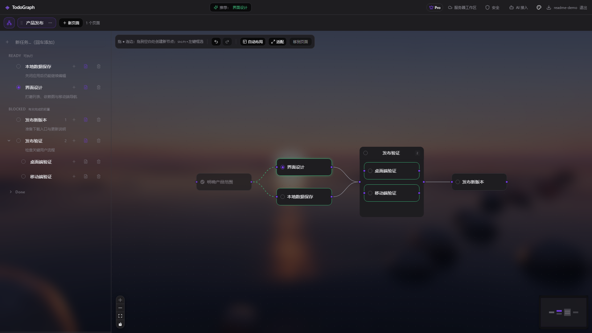
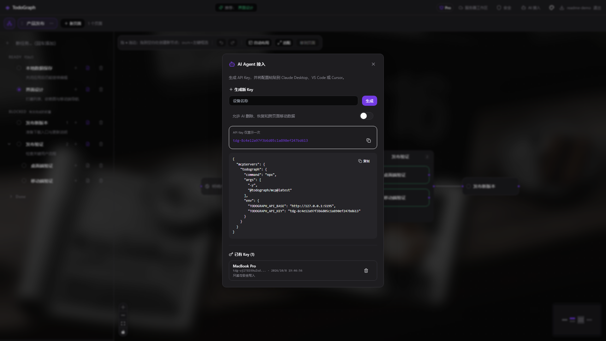
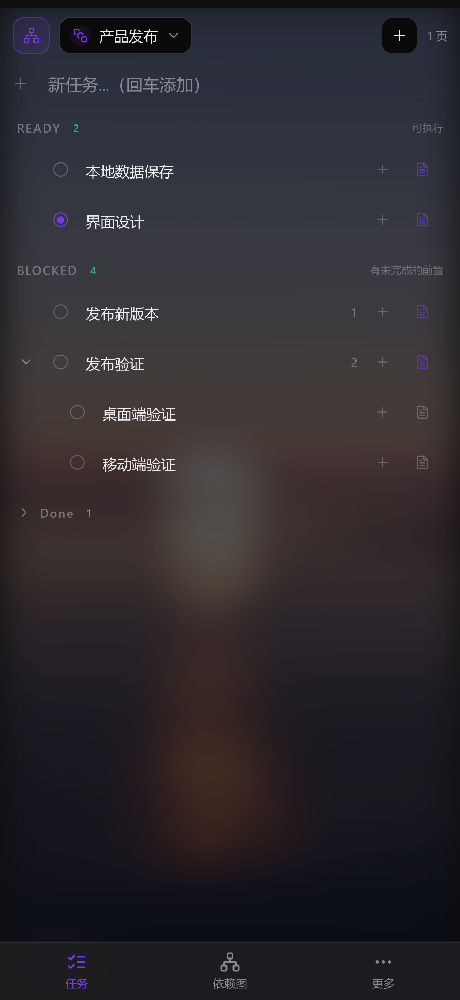
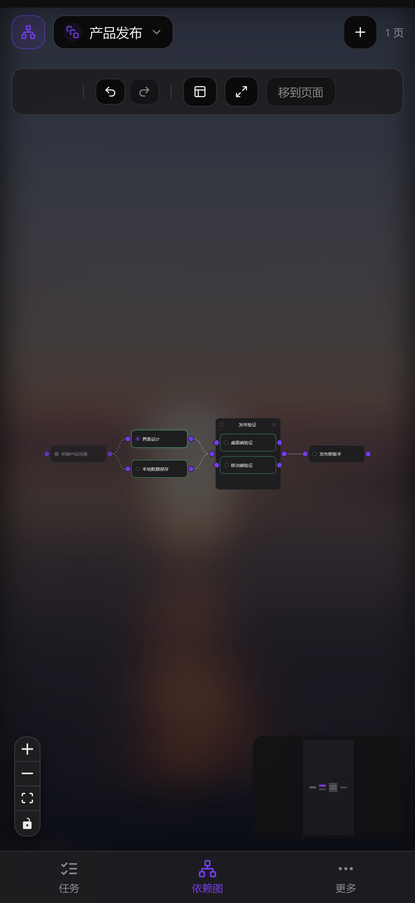

# TodoGraph

TodoGraph 用列表组织任务，用依赖图表达执行顺序。系统根据前置任务的完成状态，区分可执行任务与阻塞任务，并推荐当前适合推进的任务。创建依赖时会检测循环。

<p align="center">
  <a href="./LICENSE"></a>
  <a href="https://github.com/UriPomer/TodoGraph/stargazers"></a>
  <a href="https://github.com/UriPomer/TodoGraph/issues"></a>
  <a href="https://github.com/UriPomer/TodoGraph/commits/main"></a>
  <a href="https://github.com/UriPomer/TodoGraph/releases"></a>
</p>

<p align="center">
  
  
  
  
  
  
  
  
</p>

---

## 截图

### 桌面工作区

页面模式下，左侧列表展示任务层级和状态，右侧依赖图展示前置关系。



### AI 接入

<p align="center">
  
</p>

### 移动网页

顶部可选择页面或切换清单模式，底栏提供“任务”“依赖图”和“更多”。

<table>
  <tr><th>列表视图</th><th>依赖图视图</th></tr>
  <tr>
    <td></td>
    <td></td>
  </tr>
</table>

---

## 快速开始

需要 Node.js 22 或更高版本，以及 pnpm 10.33.2。

### 本地开发

```bash
git clone https://github.com/UriPomer/TodoGraph.git
cd TodoGraph
pnpm install
pnpm dev
```

打开 <http://127.0.0.1:5174/>。前端运行在 5174 端口，Fastify 服务运行在 5173 端口。首次创建账号无需邀请码；后续注册需要服务端配置的 `REGISTRATION_KEY`，为空时关闭后续注册。

### Docker 部署

```bash
cp .env.example .env
```

PowerShell 可用 `Copy-Item .env.example .env`。在 `.env` 中设置 `SESSION_SECRET`，其 UTF-8 编码必须正好为 32 字节。可用以下命令生成：

```bash
node -e "console.log(require('node:crypto').randomBytes(24).toString('base64'))"
```

```bash
docker compose up -d
```

打开 <http://127.0.0.1:3000/>，数据保存在 `./data`。默认回环地址使用 HTTP，保持 `COOKIE_SECURE=false`；使用 HTTPS 反向代理时设置为 `true`。

文件存储模式会用跨进程锁串行化同一台机器上对 `DATA_DIR` 的写入；不要把数据目录放在网络文件系统上。需要跨主机多实例部署时应先切换到支持事务的数据库存储。

### Windows 桌面版

双击 `build.bat` 构建便携版，产物保存在 `Build/`。在 Windows 10/11 上运行 EXE，用户数据保存在 EXE 旁的 `data/` 目录。

Electron 开发模式：`pnpm dev:electron`

### iOS 和 Android

原生移动应用使用 Capacitor。未设置 `VITE_API_BASE` 时，构建本地工作区；设置后，构建连接服务端的版本。服务地址必须是完整的 HTTPS origin，例如 `https://todo.example.com`。

PowerShell 示例：

```powershell
pnpm --filter @todograph/app build:mobile
```

连接服务端时，先设置地址再构建：

```powershell
$env:VITE_API_BASE='https://todo.example.com'
pnpm --filter @todograph/app build:mobile
```

打开原生工程：

```bash
pnpm --filter @todograph/app mobile:android
pnpm --filter @todograph/app mobile:ios
```

Android 工程可在 Windows/Android Studio 构建，Capacitor 8 的原生编译需要 JDK 21；iOS 工程需在 macOS/Xcode 中编译和签名。浏览器 cookie 与原生安全 token 相互隔离，持久原生会话分别保存在 Android Keystore 和 iOS Keychain。

---

## AI 接入（MCP）

支持 [Model Context Protocol](https://modelcontextprotocol.io/)，可通过 Claude Desktop、VS Code 和 Cursor 管理任务。点击“AI 接入”生成 Key，将页面提供的配置复制到 MCP 客户端。配置使用 `npx -y @todograph/mcp@latest` 启动 MCP 服务。

12 个 MCP 工具覆盖创建、更新、删除、推荐、自动布局和备份恢复。新 Key 默认具有读取与安全写入权限；允许删除、恢复和跨页面移动时，需要在生成 Key 时启用对应权限。

---

## 核心概念

```ts
interface Task {
  id: string;
  title: string;
  status: 'todo' | 'doing' | 'done';
  description?: string;
  parentId?: string;           // 父任务，层级分组（最大深度 3 层）
  x?: number; y?: number;      // 图中位置，有 parentId 时相对父节点
}

interface Edge {
  from: string;  // 前置任务
  to: string;    // 后续任务，前置任务完成后才能执行
}
```

- **Ready**：所有前置任务都已完成，可以执行。
- **Blocked**：还有未完成的前置任务。
- **Recommendation**：优先推荐进行中的任务，再按下游影响排序。实现 `RecommendationStrategy` 接口可替换策略。
- **清单模式**：使用列表视图汇总任务。
- **页面模式**：每个页面有独立的任务与依赖关系，可切换列表视图和依赖图视图。跨页面移动任务时包含其全部子任务。
- **认证**：浏览器使用加密的 httpOnly cookie 保存会话，各账号的数据相互隔离。

---

## 架构

```
packages/
├─ core/        DAG 引擎（纯函数，类型复用 shared）
├─ shared/      Zod schema（前后端共享，单一真源）
├─ server/      Fastify 5 后端 + 可替换的 Repository
├─ app/         React 18 前端 + Electron / Capacitor 壳
├─ desktop-host/ Electron 本地服务生命周期与会话密钥
└─ mcp/          独立发布的 MCP 服务与工具
```

前端通过 Zustand store 修改任务。服务端工作区的修改先写本地恢复草稿，再以 250 ms 防抖保存到后端。后端校验容量、依赖 DAG 和父子层级，创建恢复点后原子写入 JSON。退出或切换账号时统一清理 store、历史记录和轮询。完整数据流见 [ARCHITECTURE.md](./ARCHITECTURE.md)。

更换服务端存储时，实现 `WorkspaceRepository` 接口。主题颜色使用 `hsl(var(--xxx))` CSS 变量；新增主题需添加主题 CSS，在 `THEMES` 中注册，并在 `globals.css` 中导入。

技术栈：TypeScript 5 · React 18 · Vite 6 · React Flow · Zustand · Fastify 5 · Tailwind CSS 3 · Electron 39 · pnpm workspace · Vitest 3

---

## 开发

| 命令 | 作用 |
|---|---|
| `pnpm dev` | Fastify（5173）+ Vite（5174） |
| `pnpm dev:electron` | Electron + HMR |
| `pnpm -r build` | 编译所有包 |
| `pnpm test` | 构建依赖并运行所有包测试 |
| `pnpm test:e2e` | 运行浏览器 E2E，报告和截图保存在 `packages/app/test-results/` |
| `pnpm typecheck` | 运行所有包 TypeScript 检查 |
| `pnpm package` | 打包 Windows 便携版 EXE |
| `pnpm --filter @todograph/app build:mobile` | 构建网页资源并同步 iOS/Android 工程 |

改 `packages/shared/src/schema.ts` 后先 `pnpm --filter @todograph/shared build`，前端/后端才能拿到新类型。

---

## Roadmap

- [x] 多页面工作区、层级分组、撤销/重做
- [x] 移动端适配（手势交互、底部导航）
- [x] 用户认证、Markdown 导出
- [x] Docker 部署 + CI/CD
- [x] AI Agent (MCP)
- [ ] 时间约束（deadline 推荐）
- [ ] SQLite 存储、远程协作
- [ ] macOS / Linux 打包
- [ ] OPML / JSON 导入导出

---

## 贡献

项目使用 TypeScript 严格模式。任务修改通过 Zustand store 保存，组件颜色使用主题变量。提交 PR 时说明改动范围和实际验证结果。

---

## License

[MIT](./LICENSE) © TodoGraph contributors

---

## 致谢

- [@xyflow/react](https://reactflow.dev/) — React Flow 图编辑器
- [shadcn/ui](https://ui.shadcn.com/) — 设计系统
- [Fastify](https://fastify.dev/) — 后端框架
- [Zustand](https://zustand.docs.pmnd.rs/) — 状态管理
- [dagre](https://github.com/dagrejs/dagre) — 自动布局
