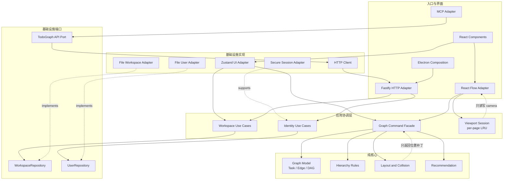

# TodoGraph 架构设计

## 1. 架构目标

TodoGraph 采用**模块化单体 + 轻量六边形架构**。

当前阶段不拆微服务，不为每个动作创建 class，也不为了目录整齐进行一次性搬迁。架构重构只解决以下实际问题：

- 图数据、React Flow 状态和 Zustand 状态存在多处写入入口；
- `GraphView` 同时负责渲染、手势、布局、碰撞和视口生命周期；
- `useTaskStore` 同时负责领域规则、历史记录、远程保存和 UI 状态；
- Fastify 路由混合了 HTTP 映射与工作区业务编排；
- 文件持久化实现同时承担迁移、事务、备份和导入导出。

核心原则是：**一个状态只有一个所有者，一个用户动作只有一条执行路径。**

## 2. 系统结构

TodoGraph 只有三个业务模块：

| 模块 | 负责 | 不负责 |
| --- | --- | --- |
| Graph | Task、Edge、DAG、层级、布局、碰撞、推荐 | 页面目录、登录、视口相机 |
| Workspace | 页面、元数据、版本、保存、备份、导入导出 | 图交互手势、身份认证 |
| Identity | 用户、密码、会话、MCP Key | 图和工作区数据 |

Viewport 不是业务模块，而是 App 内的会话状态；React Flow、Zustand、Fastify、文件系统、Electron 和 MCP 都是外围适配器。



## 3. 依赖规则

工作区包继续保持现有结构，不新增包：

```text
shared <- core
   ^        ^
   |        |
   +------ app
   +------ server
   +------ mcp
```

- `shared`：网络/存储协议、Zod schema、稳定的基础值类型。
- `core`：纯图领域规则与算法，只依赖 `shared`。
- `app`：React UI、交互协调器、视口会话、HTTP 客户端。
- `server`：应用用例、持久化端口、Fastify 与文件系统适配器。
- `mcp`：MCP 协议适配，只调用 TodoGraph API，不复制领域规则。
- Electron main 可以作为组合根引用 `server`；renderer 禁止引用 `server`。

禁止的依赖：

- `core` 不得导入 React、Zustand、React Flow、Fastify、Node API 或 Electron；
- 领域规则不得读取 store、发 HTTP 请求或操作文件；
- React 组件不得直接实现 DAG、层级、布局和碰撞规则；
- Fastify handler 不得直接实现跨页面业务事务；
- MCP tool 不得维护另一份 TodoGraph 业务实现。

## 4. 状态所有权

### 4.1 Graph 聚合

当前页面的 `nodes + edges + version` 构成一个 Graph 聚合。所有写操作通过纯命令完成：

```ts
type GraphCommandResult = {
  graph: PageData;
  changed: boolean;
};

function moveTasks(graph: PageData, command: MoveTasks): GraphCommandResult;
function setParent(graph: PageData, command: SetParent): GraphCommandResult;
function applyLayout(graph: PageData, patches: PositionPatch[]): GraphCommandResult;
```

一次命令必须原子地完成：约束校验、坐标/父节点调整和碰撞处理。调用方只观察到最终状态。

应用层在命令成功后统一完成：

1. 写入 Zustand；
2. 记录一个 undo 快照；
3. 调度一次保存；
4. 发出必要的失效通知。

### 4.2 UI 交互状态

选择框、拖动会话、merge ghost、hover timer 和确认状态属于当前挂载的 Graph Surface。它们由交互协调器持有，在切页或卸载时整体销毁，不能写入 Workspace。

### 4.3 Viewport 状态

- 每个挂载的 Graph Surface 只有一个 viewport coordinator；
- 每个页面在 session LRU 中保存一个 camera；
- 页面首次进入时居中，之后恢复自己的 camera；
- 异步恢复必须携带 activation token，旧页面结果不得覆盖新页面；
- 自动布局禁止调用 `fitView`，只能修改图坐标；
- Viewport 禁止修改任务坐标。

### 4.4 持久化状态

Zustand 不是持久化真相来源。服务端保存的 Page/Meta 及其乐观锁版本才是持久化状态。客户端可以乐观更新，但保存冲突必须显式进入冲突处理流程，不能静默覆盖。

## 5. 建议目录

这是渐进目标，不应一次性创建所有空目录：

```text
packages/
  shared/src/
    contracts/                 # API 和存储 schema
    primitives/                # ID、Point、Rect 等稳定值类型

  core/src/
    graph/
      model.ts                 # Graph 数据与基础不变量
      commands.ts              # 纯写命令
      queries.ts               # 纯查询
    hierarchy/                 # 父子关系、深度、group bounds
    layout/                    # 自动布局、放置、碰撞
    recommendation/            # ready/recommend

  app/src/
    features/graph/
      GraphSurface.tsx         # 组合入口
      graphCommandFacade.ts    # core 命令到 store/history/save 的桥接
      interaction/             # drag、selection、merge 等会话
      reactflow/                # RF 映射和事件翻译
      ui/                       # 节点与菜单组件
    features/viewport/         # coordinator、LRU、React Flow adapter
    features/workspace/        # 页面 UI 和 workspace store adapter
    infrastructure/http/       # API client
    shell/                     # App、桌面/移动布局、providers

  server/src/
    application/workspace/     # 与 HTTP 无关的工作区用例
    application/identity/      # 与 Fastify 无关的身份用例
    ports/                     # repository contracts
    adapters/http/             # routes、鉴权和 DTO mapping
    adapters/filesystem/       # page/meta/backup/transfer 内部实现
    composition/               # buildApp

  mcp/src/
    api/                       # typed TodoGraph client
    tools/                     # MCP 输入输出适配
```

不要创建通用 `utils/`、`services/`、`managers/`。无法归属的代码通常意味着模块边界还没有想清楚。

## 6. Repository 策略

当前继续保留统一的 `WorkspaceRepository` 端口，因为导入、恢复和批量保存需要跨 Page/Meta/Backup 的原子边界。

先在文件系统适配器内部拆分职责：

```text
FileWorkspaceRepository (事务门面)
├── FilePageStore
├── FileMetaStore
├── FileBackupStore
├── WorkspaceImporter
└── WorkspaceJournal
```

只有出现第二种持久化实现、独立复用需求或接口测试明显受阻时，才拆公开端口。不能为了接口隔离破坏事务一致性。

## 7. 测试边界

| 层 | 测试方式 | 禁止依赖 |
| --- | --- | --- |
| Core | 纯单元测试、表格测试、性质测试 | React、网络、文件、真实时间 |
| App coordinator | fake store、fake clock、fake React Flow | 真实服务器 |
| Server use case | in-memory repository | Fastify、真实 dataDir |
| Adapter | repository contract、route integration | 无关 UI |
| E2E | 登录、切页、编辑、重载、备份恢复 | 只覆盖关键路径 |

新增图规则只有在不挂载 React 的情况下可以验证，才算位于正确层。新增服务端业务只有在不启动 Fastify、不创建真实 dataDir 的情况下可以验证，才算位于正确层。

## 8. 渐进迁移顺序

### 阶段一：固定边界

- 加入跨包和包内依赖检查；
- 为现有 Graph/Workspace 行为补充特征测试；
- 禁止产生新的跨层导入。

### 阶段二：抽离 Graph 纯命令

- 从 `useTaskStore` 迁移 hierarchy、DAG 和 graph mutation；
- store 保持原 API，暂时作为兼容门面；
- 每迁移一个命令，先用纯单元测试覆盖。

### 阶段三：缩小 GraphView

- 提取 React Flow 数据映射；
- 提取 drag/merge/selection 交互协调器；
- 保持单一 Graph Surface 和现有 viewport coordinator；
- 组件只渲染并翻译事件。

### 阶段四：抽离服务器用例

- 从 Fastify routes 提取 Workspace/Identity 用例；
- routes 只保留鉴权、schema 解析和响应映射；
- 用 in-memory repository 测试用例。

### 阶段五：拆分文件适配器内部实现

- 保留 `WorkspaceRepository` 事务门面；
- 分离 Page、Meta、Backup、Import 和 Journal 文件；
- 用统一 contract tests 验证原子写、冲突和恢复。

### 阶段六：删除兼容路径

- 所有调用者迁移后删除 store、route 和 repository 旧实现；
- 最后再进行目录调整和命名统一；
- 每个阶段都必须可构建、可测试、可发布。

## 9. 架构验收标准

- 一个用户动作对应一个 graph command、一个 undo 记录、至多一次保存调度；
- Graph 规则可以脱离 React、Zustand 和服务器测试；
- `GraphView` 不实现领域规则，不拥有持久化状态；
- Layout 只返回位置补丁，Viewport 只读写 camera；
- 页面切换只有一个 owner，过期异步任务无法写入当前页面；
- Fastify routes 不包含工作区事务编排；
- 文件适配器保留跨文件事务和恢复能力；
- MCP 与 UI 使用同一套 API 语义；
- 依赖方向由 CI 自动检查，而不只依赖文档约定。

## 10. 非目标

- 当前不拆微服务；
- 当前不引入事件总线、CQRS 或 event sourcing；
- 不为每个命令创建 class；
- 不先创建大量 interface 和空目录；
- 不一次性重写 store、GraphView 或 repository；
- 不把 Viewport 和 Layout 建模成独立业务领域。
