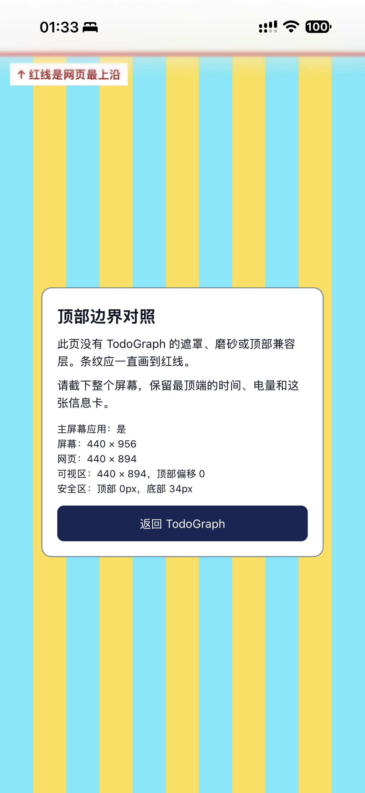

# iOS 主屏幕应用顶部区域调查

## 结论与适用范围

2026-10-05 的实机对照证明：受影响设备将顶部 62 个 CSS 像素留在网页绘制范围之外。TodoGraph 的壁纸无法进入这块区域。当前采用顶部颜色匹配，保留网页内的磨砂和透明效果。这个方案只减少色差，不消除系统区域，也不保证系统模糊消失。

用户报告升级 iOS 27 后出现问题，主屏幕应用的任务、依赖图和更多页面均受影响。正常打开应用时也存在，不限于应用切换器缩略图。具体设备型号、系统小版本和构建号未采集，不能从截图尺寸反推。

行为合同为 [NATIVE-103 至 NATIVE-105](../behavior/native-platform.md#键盘返回与安全区)。后续调整应修改这份合同及对应端到端测试，调查记录只解释证据和处理边界。

## 实机证据

独立对照页使用青黄条纹和位于网页 `y=0` 的红线，没有加载 TodoGraph 的 React、样式、磨砂层或顶部兼容层。对照页仍保留相同的 `viewport-fit=cover`、主屏幕应用声明和 `black-translucent` 状态栏声明。

| 测量项 | 用户截图读数 |
|---|---|
| `navigator.standalone` | `true` |
| `screen.width × screen.height` | 440 × 956 |
| `innerWidth × innerHeight` | 440 × 894 |
| `visualViewport.width × height` | 440 × 894 |
| `visualViewport.offsetTop` | 0 |
| `env(safe-area-inset-top)` | 0 px |
| `env(safe-area-inset-bottom)` | 34 px |
| 屏幕与网页高度差 | 62 个 CSS 像素 |

红线出现在时间、电量区域下方，条纹从红线开始。该空间不属于当前网页视口。`safe-area-inset-top=0` 也不能说明网页已经覆盖状态栏。62 px 是这台设备的测量结果，不能写成跨设备布局常量。



图片来源：用户在本次调查中提供的原始截图，1320 × 2868 像素，未裁剪或改色。

## 已排除与尚未证明的原因

| 对照操作 | 观察结果 | 能说明什么 |
|---|---|---|
| 将根画布改为蓝色 | 顶部带也变蓝 | 页面导出的底色会影响该区域；颜色变化不等于区域消失 |
| 关闭网页背景模糊 | 顶部带仍存在 | 网页的背景模糊不是该区域存在的必要条件 |
| 背景由 `fixed` 改为 `absolute` | 顶部带仍存在 | 单独改变背景定位不能恢复网页绘制范围 |
| 顶部改为壁纸代表色 | 用户确认只是颜色接近 | 可作为色彩降级方案，不能称为透明修复 |
| 完全独立的条纹页 | 状态区域仍在网页红线之外 | 排除 TodoGraph 隐藏遮罩是该区域的来源 |

另有一个独立的网页渲染问题：桌面 WebKit 可能保留图片加载前的滤镜边缘像素。图片解码后重建背景图层可消除该缓存。纯色图片端到端测试覆盖这个问题；它不解释实机上视口之外的 62 px。

[WebKit 问题 301994](https://bugs.webkit.org/show_bug.cgi?id=301994) 的评论 12 记录了同类视口缩小、顶部安全区为零和 62 px 间隔。评论 13、14 记录 iOS 27 beta 复现与官方确认。截至本次核对，状态为 `REOPENED`。这些特征与实机证据高度吻合，但尚未证明该设备与上游报告具有完全相同的内部原因。

[Apple 的状态栏声明文档](https://developer.apple.com/library/archive/documentation/AppleApplications/Reference/SafariHTMLRef/Articles/MetaTags.html) 描述 `black-translucent` 可让网页延伸到状态栏下方。实际设备未获得该绘制范围，因此不能仅凭声明存在就判定全屏正常。

## 当前颜色策略

`src/platform/wallpaper.ts` 负责壁纸就绪和顶部代表色。`ThemeProvider` 只选择主题。CSS、iOS 空取色层和 `theme-color` 共用根画布颜色，避免各自选择不同色值。

| 主题 | 已登录移动页面的顶部颜色 | 本次顶边平均色最大通道误差 |
|---|---|---|
| 玻璃·深色 `glass-dark` | 当前壁纸顶边，按 18 px 模糊、0.4 亮度及 20% 深色叠层合成 | 1.00 |
| 玻璃·浅色 `glass-light` | 当前壁纸顶边，按 18 px 模糊、0.9 亮度及 64% 白色叠层合成 | 0.95 |
| 经典·深色 `default-dark` | 页面 `--card`：`rgb(25, 32, 41)` | 0 |
| 经典·浅色 `default-light` | 页面 `--card`：`rgb(250, 250, 250)` | 0 |
| 暖素 `muted-warm` | 页面 `--card`：`rgb(253, 253, 252)` | 0 |
| 冷素 `muted-cool` | 页面 `--card`：`rgb(252, 252, 253)` | 0 |
| 素色·深色 `muted-dark` | 页面 `--card`：`rgb(27, 26, 24)` | 0 |

表中结果来自 2026-10-05 的 Chromium 和 WebKit 截图检查，视口为 440 × 894。合计 102 个主题、壁纸、页签和浏览器组合，取 RGB 各通道的最大绝对差；玻璃主题数值向上保留两位小数。5 个纯色主题像素一致，`theme-color`、iOS 取色层与根画布的差异均为零。

本次审查修正了两处不一致：`theme-color` 原先仍使用卡片底色，玻璃主题下与根画布最多相差 79 个色阶；图片未就绪时，叠色层仍绘制在备用底色上，失败场景下深色顶边相差 4 个色阶。先运行端到端测试复现，再统一颜色出口并按图片就绪状态启用背景层。

玻璃主题采样当前 `cover` 裁剪位置附近的图片颜色，按模糊半径加权。窗口尺寸改变后重新采样，不能使用整张照片的平均色。照片沿水平方向存在色差时，单一系统颜色只能接近整条顶边的代表色，无法与每个位置同时相等。

登录页和壁纸尚未就绪时使用各主题的 `--card`，背景图片及叠色层均隐藏。图片加载失败时继续使用这个底色。普通浏览器标签页不启用 iOS 取色层。宽度达到桌面布局断点时，以不透明桌面顶栏的 `--card` 为准。

`.ios-status-bar-edge` 是空元素，使用 `background-clip: text`，不绘制网页像素，也不接收点击。其 11 px 高度用于兼容取色，不代表状态栏高度。这是依赖浏览器行为的临时处理；将来系统恢复正确绘制范围后，需要实机比较有无该层，再决定删除。

实现入口：

- [壁纸与取色](../../packages/app/src/platform/wallpaper.ts)
- [根画布、取色层和移动背景样式](../../packages/app/src/styles/globals.css)
- [主题清单](../../packages/app/src/features/theme/themes.ts)
- [HTML 状态栏声明](../../packages/app/index.html)

## 顶栏比例

网页顶栏在原工具栏上方延伸 8 CSS px 的同色带，网页内顶部安全区也使用此颜色。色带共用 `--page-chrome-color`，随主题与壁纸变化；按钮尺寸保持不变，上下各留 8 CSS px；移动列表中，顶栏按钮到输入框、输入框到分区标题的间隔均为 12 CSS px，任务行尺寸保持不变；任务和依赖图工具栏为 60 CSS px，更多首页为 56 CSS px，设置子页为 68 CSS px，另加网页内顶部安全区。色带由工作区外壳的固定伪元素绘制，处于切页快照和回退动画的边界之外，避免移动或淡出造成接缝；主题变化直接更新这层颜色。底栏保留原有图标、文字和上下 8 CSS px 内边距，只缩短按钮下方的额外留白：系统底部安全区减 8 CSS px，最小为零。任务、依赖图、更多及设置子页共用此规则。样式入口为 [mobile-chrome.css](../../packages/app/src/styles/mobile-chrome.css)。

在本次实机读数下，底部安全区为 34 px：按钮下方额外留白为 26 px，底栏约 81.5 px；顶部网页色带为 8 px，与网页外 62 px 的状态区域形成约 70 px 的同色区域。系统区域本身仍由 iOS 绘制。生产布局只读取 CSS 安全区，不推算屏幕与视口的高度差；内容底部与撤销提示共用底栏高度。缩短后的留白是否与 Home indicator 保持合适距离，需由实机截图和点击验证。

`mobileChrome.spec.ts` 模拟网页外状态区域、完整视口安全区和普通浏览器，验证上下栏高度、按钮尺寸、底部安全区和内容边界，并检查键盘、缩放和旋转。`chromeTransitions.spec.ts` 将切页动画暂停在中途，逐像素检查同色带的连续性，覆盖七套主题、主题切换、子页进入和返回，以及没有 View Transition API 的回退动画。报告附尺寸和颜色 JSON，截图只包含网页范围。运行命令为 `pnpm --filter @todograph/app exec playwright test mobileChrome.spec.ts chromeTransitions.spec.ts --project=ios-webkit --project=android-chromium`。最终比例通过完整实机截图验收。

## 可重复验证

在仓库根目录运行以下 PowerShell 命令。测试启动隔离的 Fastify 和 Vite，不使用生产数据。

```powershell
$env:pnpm_config_verify_deps_before_run = 'false'
$env:PLAYWRIGHT_JSON_OUTPUT_FILE = "$PWD/packages/app/test-results/theme-chrome-verified.json"
node node_modules/@playwright/test/cli.js test --config packages/app/playwright.config.ts themeChrome.spec.ts backgroundRendering.spec.ts wallpaperChrome.spec.ts mobileStatusBar.spec.ts --project ios-webkit --project android-chromium --output packages/app/test-results/theme-chrome-verified --reporter list,json
```

[themeChrome.spec.ts](../../packages/app/e2e/themeChrome.spec.ts) 从浏览器截图读取顶边像素，独立于生产取色算法。它遍历全部 7 个主题、玻璃主题的 6 张真实壁纸和 3 个移动页签，覆盖登录页、慢加载和加载失败。纯色页面应保持同色；壁纸顶边平均 RGB 与输出色每通道误差最多为 3（范围 0～255）。输出的 iOS 取色层和 `theme-color` 必须与根画布相同。

`wallpaperChrome.spec.ts` 覆盖横竖屏裁剪变化及退出登录。`backgroundRendering.spec.ts` 使用延迟加载的均匀图片检查网页内顶边连续性。`mobileStatusBar.spec.ts` 检查安全区、各页工具栏及取色层不遮挡内容。JSON 报告包含颜色读数，输出目录保存截图，失败时保留 trace。

本次完整命令结果为 31 项通过、0 项失败、0 项跳过。应用 TypeScript 检查和 `build:web` 构建也通过。这些结果对应上述网页检查，不替代实机验收。

Windows 上的 Playwright WebKit 不包含 iOS 的系统状态栏合成器。上述测试只能验证网页像素和提供给系统的颜色，不能证明手机状态栏已经变透明或与网页完全同色。

实机验收从同一个主屏幕图标进入应用，依次切换 7 个主题并查看 3 个页签，检查顶边色差和文字可读性。玻璃主题需重新进入应用检查不同壁纸，并旋转屏幕。保留完整截图及系统版本；如果颜色未更新，应分别记录当前窗口和关闭后重新打开的结果，以区分系统颜色缓存。

需要重新判断绘制边界时，使用以下独立静态页面和脚本。脚本单独保存为同目录的 `top-edge-check.js`，满足生产站点只允许同源脚本的策略。临时部署后，从应用内同窗口导航进入，避免改变主屏幕运行方式。采集后移除临时文件和入口。

```html
<!doctype html>
<meta name="viewport" content="width=device-width, initial-scale=1, viewport-fit=cover">
<meta name="apple-mobile-web-app-capable" content="yes">
<meta name="apple-mobile-web-app-status-bar-style" content="black-translucent">
<style>
  html { background: repeating-linear-gradient(90deg, #8de2ed 0 40px, #f7e46b 40px 80px); }
  body { margin: 0; }
  #line { position: absolute; top: 0; width: 100%; height: 6px; background: red; }
  #safe { position: absolute; visibility: hidden; padding: env(safe-area-inset-top) 0 env(safe-area-inset-bottom); }
  pre { margin: 35vh 8vw 0; padding: 20px; background: white; color: black; white-space: pre-wrap; }
</style>
<div id="line"></div><div id="safe"></div><pre id="info"></pre>
<script src="./top-edge-check.js"></script>
```

```javascript
  const safe = getComputedStyle(document.getElementById('safe'));
  const vv = visualViewport;
  document.getElementById('info').textContent = JSON.stringify({
    standalone: navigator.standalone === true,
    screen: [screen.width, screen.height],
    window: [innerWidth, innerHeight],
    visualViewport: [vv?.width, vv?.height, vv?.offsetTop],
    safeArea: [safe.paddingTop, safe.paddingBottom]
  }, null, 2);
```

验收保留时间、电量、网页红线和测量文字。先判断红线相对于系统区域的位置，再定位网页内元素。单独改色、关闭磨砂或通过自动化测试，都不足以证明系统预留区域已消失。
